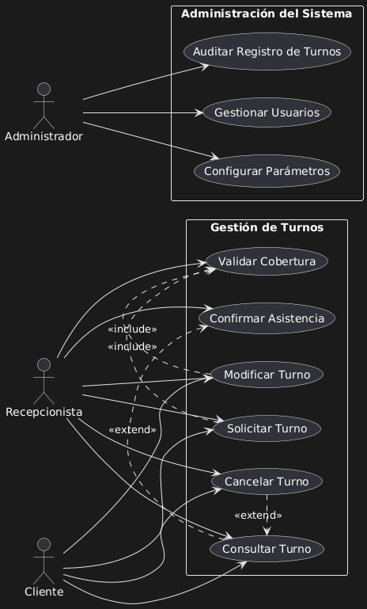
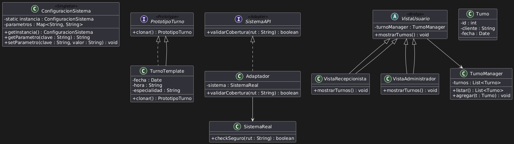
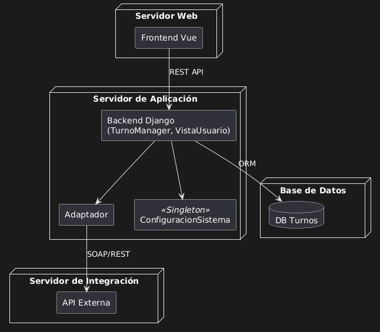

# Sistema Tunomático

## ✅ Descripción General del Sistema
Este proyecto corresponde al modelado arquitectónico del **Sistema Tunomático**, una solución orientada a la digitalización y gestión eficiente de turnos en instituciones del sector salud.

El sistema está diseñado para:
- Facilitar la asignación y administración de turnos de atención médica.
- Integrarse con sistemas externos (ej. validación de cobertura médica).
- Proveer interfaces diferenciadas para pacientes, recepcionistas y administradores.
- Asegurar la trazabilidad y auditoría completa de las operaciones.

---

## 🔍 Objetivos del Modelado
- Representar de manera clara la arquitectura del sistema desde el punto de vista funcional, lógico y físico.
- Aplicar patrones de diseño orientados a resolver necesidades técnicas específicas.
- Estandarizar la documentación para facilitar su uso como referencia profesional.

---

## 🔹 1. Diagrama de Casos de Uso UML

### Descripción general
Se identificaron actores clave y flujos funcionales que reflejan la lógica operativa del sistema, incorporando relaciones `<<include>>` y `<<extend>>` para detallar procesos opcionales y obligatorios.

#### Actores identificados:
- **Cliente**: Solicita, modifica o cancela turnos.
- **Recepcionista**: Registra turnos manuales, valida presencia, edita y cancela reservas.
- **Administrador del Sistema**: Configura parámetros globales, gestiona usuarios, accede a reportes y auditorías.

#### Casos de uso destacados:
- **Asignación de Turno Online**
  - `<<extend>>` Validación de Cobertura Médica.
- **Modificación de Turno**
  - `<<include>>` Verificación de Disponibilidad.
- **Cancelación de Turno**
  - `<<extend>>` Envío de Confirmación al Paciente.
- **Auditoría de Turnos**
  - `<<include>>` Generación de Reportes de Actividad.
- **Gestión de Configuración del Sistema**
  - Permite la parametrización centralizada.

---

## 🔹 2. Diagrama de Clases UML con Patrones Aplicados

---

## 🧩 Justificación Arquitectónica y Patrones Aplicados

### **1. Singleton (`ConfiguracionSistema`)**
#### Justificación:
Control centralizado de parámetros críticos como horarios de atención, duración de turnos, cantidad máxima por día, etc.

#### Intención:
- Evitar duplicación de lógica de configuración.
- Proveer acceso consistente y global.

---

### **2. Prototype (`PlantillaTurno`)**
#### Justificación:
Permite la clonación de configuraciones comunes para creación rápida de nuevos turnos.

#### Intención:
- Agilizar la definición de nuevos bloques de turnos.
- Facilitar escenarios repetitivos (ej. lunes a viernes, 9:00 a 13:00).

---

### **3. Adapter (`Adaptador`)**
#### Justificación:
Permite desacoplar el sistema interno de la lógica de validación externa. Si el sistema de validación cambia, no afecta al núcleo.

#### Intención:
- Mantener independencia tecnológica.
- Facilitar adaptaciones con múltiples prestadores.

---

### **4. Bridge (`InterfazUsuario` + `VistaUsuario`, `VistaRecepcionista`, `VistaAdmin`)**
#### Justificación:
Separa la lógica de negocio de las distintas vistas del sistema. Cada rol accede a funciones específicas mediante su interfaz correspondiente.

#### Intención:
- Reutilizar lógica común.
- Adaptar la presentación según tipo de usuario o dispositivo.

---

## 🔹 3. Diagrama de Implementación UML

### Despliegue físico y decisiones técnicas:
- Separación de nodos para backend, base de datos, sistema de validación externa y vista web.
- Uso de protocolos REST para integraciones.
- Nodo dedicado a configuración y gestión de auditorías.
- Escalabilidad considerada mediante servicios desacoplados.

---

## 🧩 Reflexiones Finales del Modelado

El diseño arquitectónico del **Sistema Tunomático** presenta:
- Coherencia entre casos de uso, clases y despliegue.
- Aplicación de patrones con fundamentos claros y necesidades reales.
- Modularización que permite escalabilidad y mantenimiento.
- Orientación profesional y reutilizable como base para desarrollos futuros.
